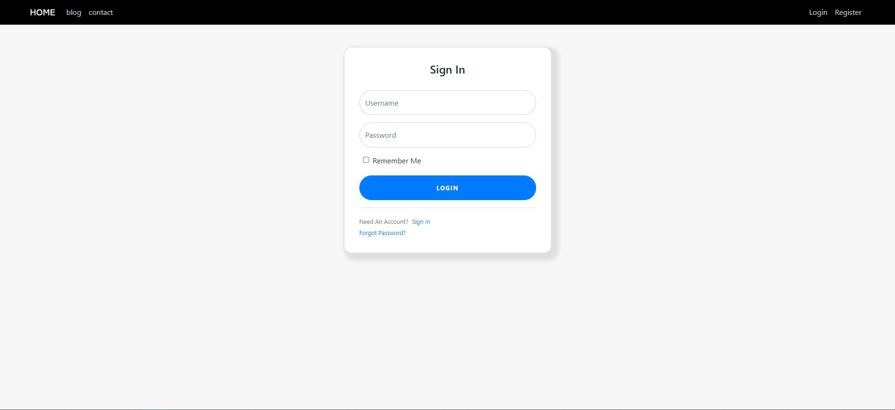

# portfolio_website

Portfolio website Template using Flask Framework.

<h2> Login Page </h2>

contains portfolio content :
- achievements
- experience 
- portfolio 
- Education

Flask Usage : 
- Login and Registration System
- User Account system
- reset password function using email request
- SQL databse to store user and post data
- form validations 
- password encryption and authentication 
- Modify personal account infomation and upload image
- logout system
- customised error pages and error handling

Flask Blog usage :
- Dynamic user posts, showing different user's post
- Ability to create, update and delete post
- view other users account posts
- post split into different pages
