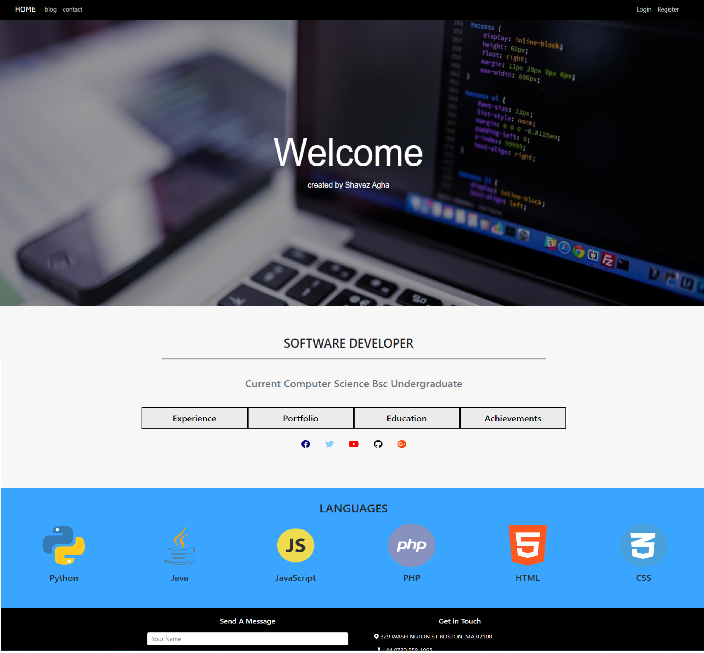
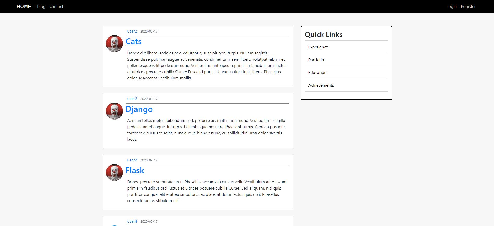
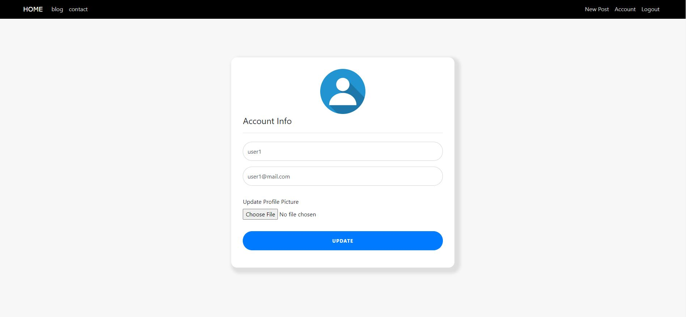
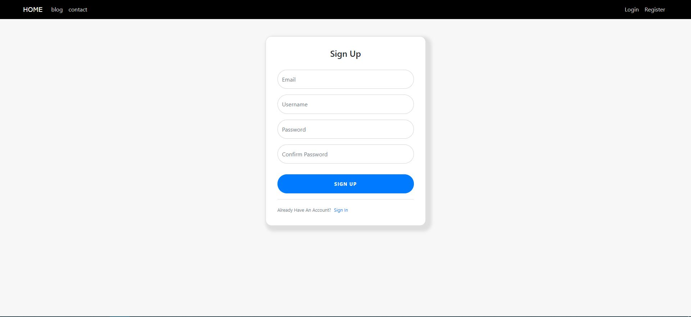

# portfolio_website

Portfolio and Blog website using Flask Framework.

<h2> Home Page </h2>

includes:
- links to other pages 
- contact me section
- responsive

<h2> Blog Page </h2>

includes:
- Dynamic user posts, showing different user's post
- Ability to create, update and delete post
- view other users account posts
- post split into different pages

<h2> Account Page </h2>

includes:
- modify personal details (email, username)
- change profile picture
- fields are auto filled

<h2> Login Page </h2>

includes:
- login user
- remember me button
- option to sign in
- forgot password procedure 

<h2> Register Page </h2>

includes:
- register user
- option to sign in

Flask Usage : 
- Login and Registration System
- User Account system
- reset password function using email request
- SQL databse to store user and post data
- form validations 
- password encryption and authentication 
- Modify personal account infomation and upload image
- logout system
- customised error pages and error handling

